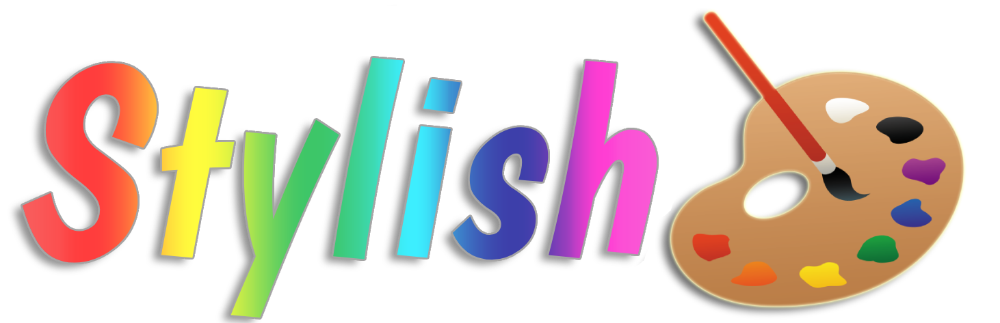
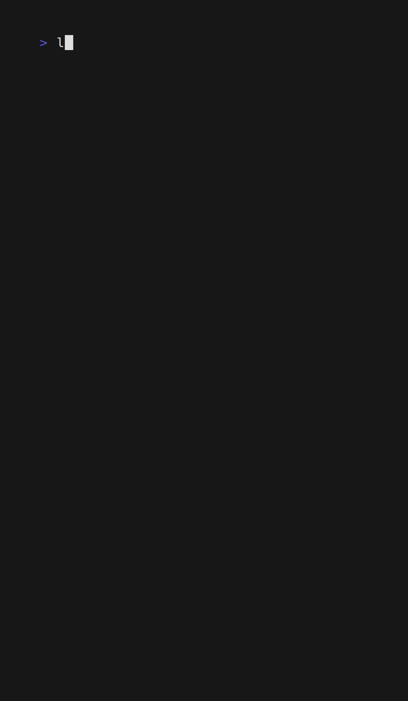

<div align="center"">
    
    <h3>A simple and intuitive way to create and apply stylish config files 🖌️</h3>
    <h3>Works with <code>ls</code>, <code>tree</code>, <code>fd</code>, <code>exa</code>, and anything else that respects <code>$LS_COLORS</code></h3>
    <br />
    
</div>

<div align="center">
    <h2>Why use <code>stylish</code> ❓</h2>
</div>

- NO file editing!
- NO dealing with encoding strings!
- NO manual mapping of hex codes to 8-bit colors!
- NO blindly working without an actual preview!
- NO need to hunt down scattered, poor documentation and references!

<div align="center">
    <h2>Quick Start 🌩️</h2>
</div>

If you are comfortable with the defaults and just want to fast track your way to a pretty terminal, then you're just 2 steps away.

- Install via one of the methods below
- Add the following to your shell's init script:
```sh
eval $(stylish apply default)
alias ls=ls --color=auto
```
- Be stylish on every future shell launch

<div align="center">
    <h2>Installation ⬇️</h2>
</div>

> [!IMPORTANT]
> If you're on Mac, do the following alongside the normal installation

Ensure you have `coreutils` installed AND added to your `PATH` by following the instructions on the [coreutils brew page](https://formulae.brew.sh/formula/coreutils)

### Github Releases 🐙

- Go to the `Releases` tab of the repo [here](https://github.com/DaltonSW/stylish/releases)
- Download the latest binary for your OS
- Place it on your `$PATH` and ensure it is executable

### Homebrew 🍺 

- Have `brew` installed
- Run the following:
```sh
brew install daltonsw/tap/stylish
```

### Go 🖥️ 

- Have `Go` 
- Have your `Go` install location on your `$PATH`
- Run the following: 
```sh
go install go.dalton.dog/stylish@latest
```

<div align="center">
    <h2>Usage ⚙️</h2>
</div>

- Start the program with `stylish`. This will:
    - Create a `stylish` directory in your user's default config directory (typically `~/.config`)
    - Create a `default` theme inside of that directory. **Note:** This theme is intended to be used on a dark background
- With the program running, you're able to create and edit your themes to your heart's content
- Once you're ready to apply a theme, you'll need to add the following to your shell's init file (`~/.bashrc`, `~/.zshrc`, etc.):
    - **Required:** `eval $(stylish apply <theme>)`
    - *Recommended:* `alias ls=ls --color=auto`
- Once your init file is edited, relaunch your shell to start seeing the updated colors.

### P.S.

Want to handle your hex code journey in your terminal too? Check out [termpicker](https://github.com/ChausseBenjamin/termpicker)!

<div align="center">
    <h2>Commands 📜</h2>
</div>

### `stylish`

*Launch the TUI*

- If you run the program without any subcommands, it will launch you directly into the editor TUI

### `stylish apply [theme]`

*This command turns the theme's YAML files into the final environment variable expected format*

- Converts the given theme's YAML definition files into a `dircolors` compatible file
- Saves the `.dircolors` file in the root of the theme's directory
- Runs `dircolors` on the generated file to get the appropriate `LS_COLORS` string
- Returns a command that's ready to be `eval`'d to automatically export the `LS_COLORS` string to the environment variable

### `stylish example [theme]`

*This command is to make setting up directories for example screenshots significantly easier and quicker*

> [!WARNING]
> This command requires the `tree` command to be installed

- Creates an `example` directory located in your theme's root
- For each style in your theme, a new directory is created matching the style's name
- For each filetype associated with the theme (up to 4), a random filename is generated and a blank file is created with that name and filetype

<div align="center">
    <h2>Shoutouts 🗨️</h2>
</div>

- [Jess](https://jessicakasper.com) for the great banner!
- [Vivid](https://github.com/sharkdp/vivid) for being a great program and a great reference
- [Catppuccin](https://github.com/catppuccin) for having pretty palettes
- [CharmBracelet](https://github.com/charmbracelet) for the amazing modules for style, form, and function

<div align="center">
    <h2>Contributions 💜</h2>
</div>

Contributions are very welcome! I'd love for y'all to contribute themes you develop as well as expanding on the defaults to make them more reasonable. Check out the [CONTRIBUTING](./CONTRIBUTING.md) file for specifics.

<div align="center">
    <h2>License ⚖️</h2>
</div>

Copyright 2025 - Dalton Williams  
Check [LICENSE](./LICENSE.md) in repo for full details
